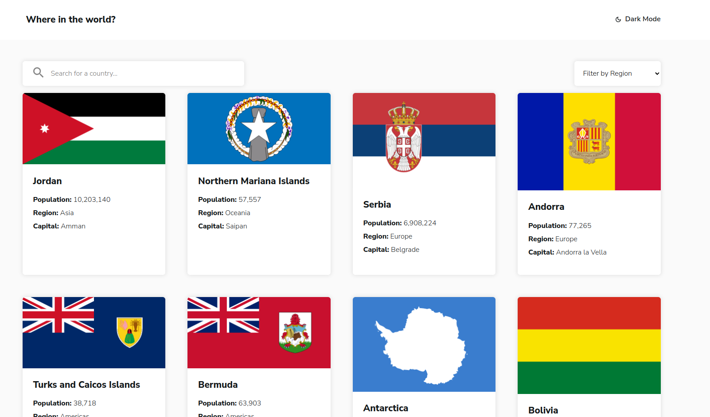
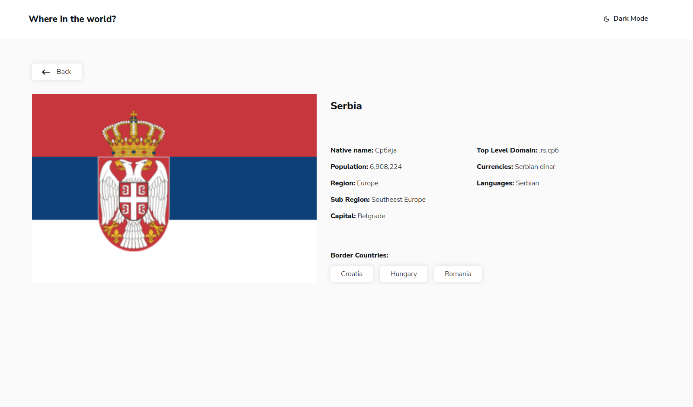
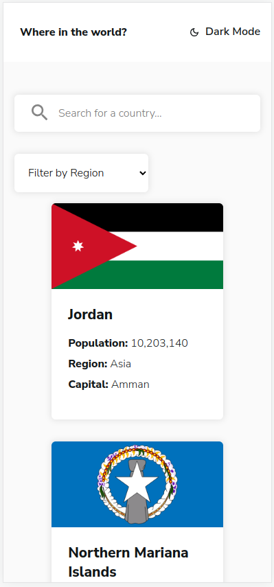
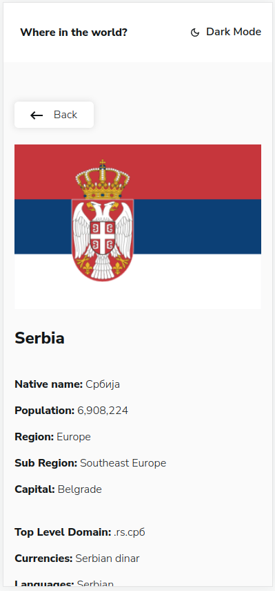
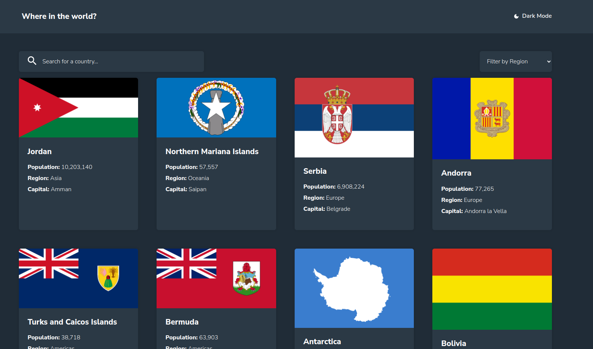
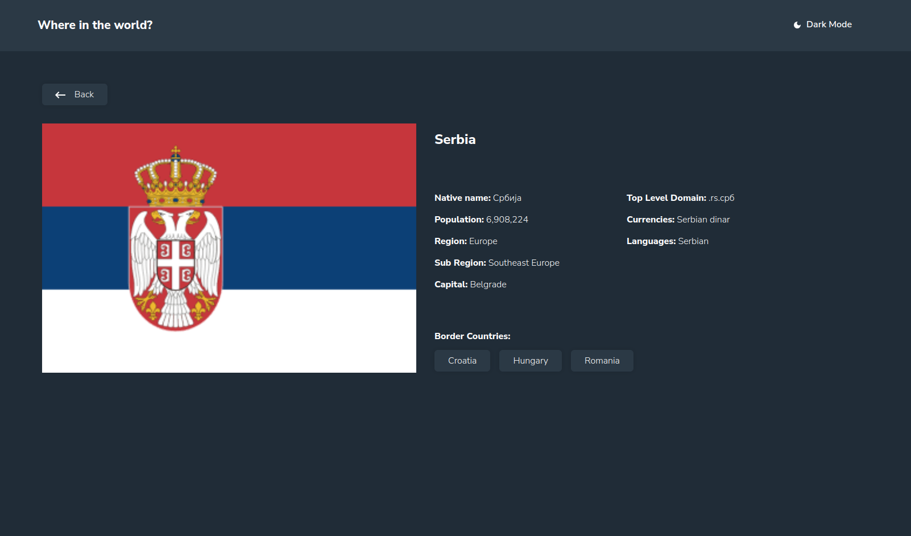
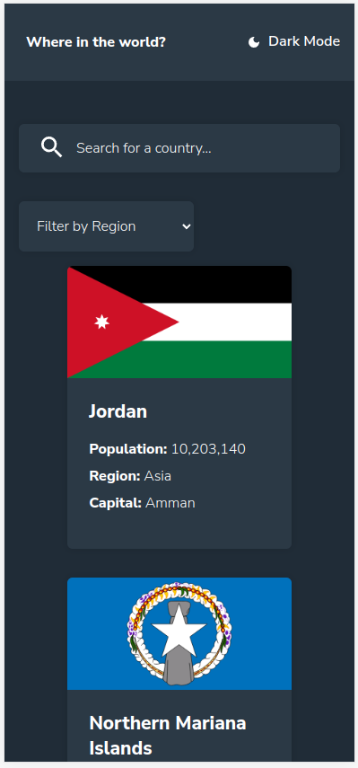
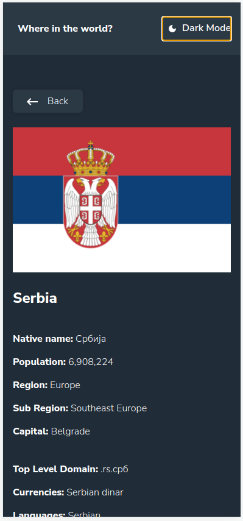

# Frontend Mentor - REST Countries API with color theme switcher solution

This is a solution to the [REST Countries API with color theme switcher challenge on Frontend Mentor](https://www.frontendmentor.io/challenges/rest-countries-api-with-color-theme-switcher-5cacc469fec04111f7b848ca). Frontend Mentor challenges help you improve your coding skills by building realistic projects.

## Table of contents

- [Overview](#overview)
  - [The challenge](#the-challenge)
  - [Screenshot](#screenshot)
  - [Links](#links)
- [My process](#my-process)
  - [Built with](#built-with)
  - [What I learned](#what-i-learned)
  - [Useful resources](#useful-resources)
- [Author](#author)

## Overview

### The challenge

Users should be able to:

- See all countries from the API on the homepage
- Search for a country using an `input` field
- Filter countries by region
- Click on a country to see more detailed information on a separate page
- Click through to the border countries on the detail page
- Toggle the color scheme between light and dark mode

### Screenshot










### Links

- Live Site URL: [Countries Live URL](https://countries-chi-coral.vercel.app/)

## My process

### Built with

- Semantic HTML5 markup
- CSS custom properties
- Flexbox
- CSS Grid
- Mobile-first workflow
- React
- TypeScript
- CSS Modules
- Axios
- React Router Dom
- React Icons

### What I learned

Using Outlet Context from React Router Dom to set the theme:

```ts
const [theme, setTheme] = useState<"light" | "dark">("light");

const changeTheme = () => {
  setTheme((prev) => (prev === "light" ? "dark" : "light"));
};

...

<Outlet context={{ theme }} />;

...

type ThemeContext = {
  theme: "dark" | "light";
};

const useTheme = () => {
  return useOutletContext<ThemeContext>();
};
```

Fetching many at once, to avoid awaiting for one answer before doing another request:

```ts
await Promise.all(
  urls.map(async (url) => {
    const response = await client.get(url);
    setData((prevData) => {
      prevData.push(response.data as ResponseType);
      return prevData;
    });
  })
);
```

### Useful resources

- [Fetch with TypeScript](https://www.newline.co/@bespoyasov/how-to-use-fetch-with-typescript--a81ac257) - This helped me adding types to the project.
- [Objects with unknown keys in TypeScript](https://www.becomebetterprogrammer.com/typescript-objects-with-unknown-keys-and-known-values/) - This helped me declaring interfaces with unknown keys.
- [Removing duplicates from array of objects](https://stackoverflow.com/questions/2218999/how-to-remove-all-duplicates-from-an-array-of-objects) - This helped me removing duplicated border countries.
- [Outlet context - React Router Dom](https://reactrouter.com/en/main/hooks/use-outlet-context) - This helped me implement the dark mode using outlet context.

## Author

- LinkedIn - [Winstein Martins](https://www.linkedin.com/in/winstein-martins/)
